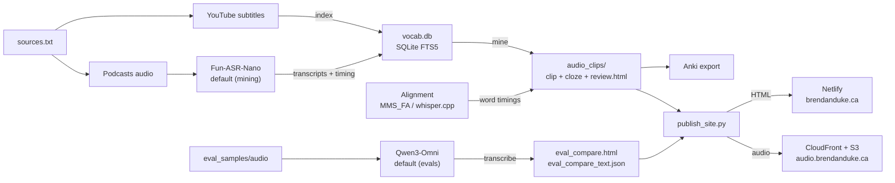

# audio-cloze

Mine Chinese vocabulary from YouTube and podcasts. Generate audio cloze cards for Anki.

## What it does

You give it a Chinese word. It finds that word spoken in real content, extracts the audio clip, and creates a version with the target word silenced (the "cloze"). You review the clips and export to Anki.



## The trick

YouTube videos have subtitles with timestamps. Podcasts have no captions, so we build
an ASR transcript index. So:

1. **YouTube**: Search subtitles → instant timing → extract clip
2. **Podcasts**: Run ASR to build transcript index → search transcripts → align timing → extract clip

ASR is expensive, so we index once and reuse it. We only run extra ASR for
timing after a word is found in the transcript index.

## Current index

| Source | Count | Notes |
|--------|-------|-------|
| YouTube videos | 219 | 4 channels, full subtitle search |
| Podcast episodes | 587 | 12 feeds, full ASR transcript index |

## Setup

Recommended (uv, reproducible + isolated):
```bash
# Install uv (once)
python -m pip install --user uv

# Create local venv + install base deps
uv venv
uv sync

# Optional: ASR stack (Fun-ASR-Nano, GLM-ASR, WhisperX alignment)
uv sync --extra asr

# Optional: MLX + Qwen3-Omni (Apple Silicon)
uv sync --extra mlx
```

Then run commands with:
```bash
uv run python audio_vocab_miner.py index --sources sources.txt --db vocab.db
```

If you prefer pip:
```bash
python -m venv .venv
source .venv/bin/activate
pip install -e ".[asr,mlx]"
```

For podcast ASR with whisper.cpp instead:
```bash
brew install whisper-cpp
# Download large-v3 model (~3GB)
curl -L -o models/ggml-large-v3.bin \
  "https://huggingface.co/ggerganov/whisper.cpp/resolve/main/ggml-large-v3.bin"
```

For faster ASR on Apple Silicon, also grab the CoreML encoder:
```bash
curl -L -o models/ggml-large-v3-encoder.mlmodelc.zip \
  "https://huggingface.co/ggerganov/whisper.cpp/resolve/main/ggml-large-v3-encoder.mlmodelc.zip"
unzip models/ggml-large-v3-encoder.mlmodelc.zip -d models/
```

### Alternative ASR Backends

**Fun-ASR-Nano** (800M params, Chinese + dialects) + **GLM-ASR** (transformers, 1.5B params):
```bash
uv sync --extra asr
```
The lockfile pins Transformers from git to ensure GLM-ASR's `glmasr` architecture is supported.
First run downloads the Fun-ASR-Nano weights plus the Qwen3-0.6B LLM weights.

If your Python build is missing `_lzma` (common with pyenv), install xz headers
and then:
```bash
brew install xz
CFLAGS="-I/opt/homebrew/opt/xz/include" LDFLAGS="-L/opt/homebrew/opt/xz/lib" \
  pip install backports.lzma
```

Set device/dtype via env vars, e.g. `GLM_ASR_DEVICE=mps` or `GLM_ASR_DTYPE=float16`.
Use `GLM_ASR_PREFER_ENDPOINT=1` with `--glm-endpoint` to target an OpenAI-compatible
`/audio/transcriptions` server.

## Usage

If using uv, either activate `.venv` or prefix commands with `uv run`.

```bash
# Index sources (YouTube + podcasts). Podcasts are fully transcribed.
python audio_vocab_miner.py index --sources sources.txt --db vocab.db

# Use whisper.cpp for podcast indexing if desired
python audio_vocab_miner.py index --sources sources.txt --db vocab.db \
  --podcast-asr-backend whispercpp

# Reindex specific podcast episodes by title
python audio_vocab_miner.py index --sources sources.txt --db vocab.db \
  --type podcast --podcast-title "TAXI DRIVER" --podcast-reindex

# Check what's indexed
python audio_vocab_miner.py stats --db vocab.db

# Mine a word
python audio_vocab_miner.py mine 面交 --db vocab.db -o audio_clips

# Mine multiple words
python audio_vocab_miner.py mine 保鮮膜 托運 剪刀 --db vocab.db -o audio_clips

# Default ASR backend is Fun-ASR-Nano. Override if needed:
python audio_vocab_miner.py mine 護城河 --db vocab.db --asr-backend whispercpp

# Mine with alternative ASR backend
python audio_vocab_miner.py mine 護城河 --db vocab.db --asr-backend funasr_nano

# Mine with GLM-ASR (local)
python audio_vocab_miner.py mine 護城河 --db vocab.db --asr-backend glm_asr

# Regenerate review page
python audio_vocab_miner.py review -o audio_clips
```

Open `audio_clips/review.html` to listen, approve/reject, then export to Anki.

## Evaluation

```bash
# Run evals over existing samples (adds missing backends)
GLM_ASR_DEVICE=mps python eval_asr_accuracy.py

# Fresh sample set
python eval_asr_accuracy.py --fresh --num-youtube 10 --num-podcast 6 \
  --backends whisper-large-v3,funasr-nano,glm-asr
```

Qwen3-Omni (MLX, Mandarin evals only) requires `mlx-vlm` 0.3.10+ (GitHub install)
and uses `librosa`/`soundfile` for audio decoding (mp3 may require ffmpeg or
another audioread backend).

Results are written to `eval_samples/eval_results.json`,
`eval_samples/eval_compare.html`, and `eval_samples/eval_compare_text.json`.
The HTML and comparison JSON normalize output text to traditional characters
when `opencc-python-reimplemented` is installed. Audio clips are cached under
`eval_samples/audio` (gitignored). Use `--audio-dir` to change the cache
location.

## Hosting

Static HTML pages are deployed via the `dukebw/personal-website` repo, while
audio binaries live in S3/CloudFront. Use `scripts/publish_site.py` to build
HTML, rewrite audio URLs, sync audio to S3, and copy HTML into the website repo.
See `docs/hosting.md` for the full flow and required environment variables.

## Docs

- `docs/hosting.md` — Private S3 + CloudFront hosting flow.
- Add new docs here so README stays the entry point.

## Output

For each word found:
```
audio_clips/
├── 面交_sxerWKZjaKs_clip.mp3   # Full sentence with context
├── 面交_sxerWKZjaKs_cloze.mp3  # Same clip, target word silenced
├── clips.json                   # Metadata for all clips
└── review.html                  # Web UI for reviewing
```

## ASR Backends

| Backend | Speed | Word Timestamps | Notes |
|---------|-------|-----------------|-------|
| Fun-ASR-Nano | ~10x RT | Forced alignment | Default |
| GLM-ASR | ~10x RT | Forced alignment | 1.5B params, transformers |
| whisper.cpp + CoreML | 12-20x RT | Native | Best timestamps, heavier setup |
| mlx-whisper | 12-15x RT | Native | Alternative Whisper |

- **Native timestamps**: Word timing from ASR output
- **Forced alignment**: Uses torchaudio MMS_FA for character-level timing

Performance varies with thermal state on Apple Silicon.

## Adding sources

Edit `sources.txt`:

```
# YouTube channels
youtube https://www.youtube.com/@shasha77 志祺七七

# Podcast RSS feeds
podcast https://feeds.buzzsprout.com/1974862.rss 百靈果News
```

Then re-run `index`.

## How clips.json works

Each mining run merges with existing clips. You won't lose previous work:

```json
{
  "word": "面交",
  "video_id": "sxerWKZjaKs",
  "transcript": "很多時候交朋友一定是要當面交談過才算數",
  "word_start": 8.0,
  "word_end": 10.97,
  "source_type": "youtube",
  "timing_confidence": "subtitle"
}
```

## Simplified ↔ Traditional

Searches both. If you search 护城河, it also searches 護城河.
