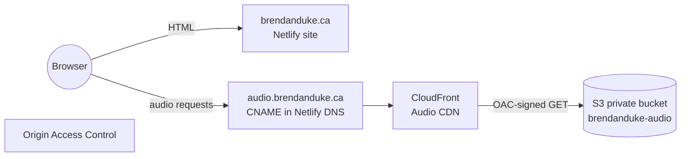
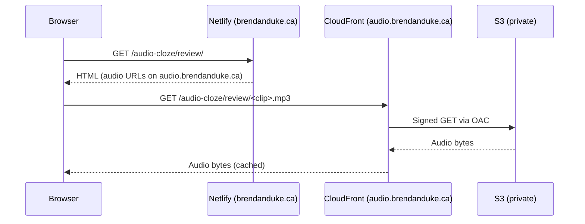
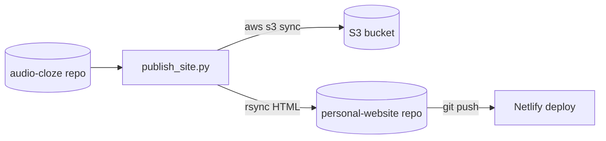

# Hosting audio-cloze artifacts

This project publishes **HTML** to `brendanduke.ca` (via the `dukebw/personal-website` repo)
while hosting **audio binaries** in S3 (or behind CloudFront). This keeps the website repo lean
and scales as clips grow.

## Target URLs

- `https://brendanduke.ca/audio-cloze/` → landing page
- `https://brendanduke.ca/audio-cloze/review/` → `audio_clips/review.html`
- `https://brendanduke.ca/audio-cloze/evals/zh/` → Mandarin eval report
- `https://brendanduke.ca/audio-cloze/evals/ja/` → Japanese eval report

Audio is served from a separate origin:

- `https://audio.brendanduke.ca/audio-cloze/...` (recommended) or
- a CloudFront/S3 public URL.

## Architecture (private S3 + CloudFront)



### Request path (what happens on playback)



## Publish flow (local → S3 + site)



## Prerequisites

- AWS CLI configured (`aws configure`)
- An S3 bucket for audio, e.g. `s3://brendanduke-audio`
- (Optional) CloudFront distribution pointing `audio.brendanduke.ca` to the bucket
- S3 CORS rule that allows `GET` from `https://brendanduke.ca` (for cross-origin audio)
- `rsync` available (macOS default)

## Publish flow

The script builds a small `dist/` folder, rewrites audio URLs to the CDN base,
uploads audio to S3, and syncs HTML into `personal-website` (served at `/audio-cloze/`).

```bash
export AUDIO_CLOZE_AUDIO_BASE_URL="https://audio.brendanduke.ca"
export AUDIO_CLOZE_S3_BUCKET="s3://brendanduke-audio"

python scripts/publish_site.py --delete
```

Then commit/push the `personal-website` repo to deploy.

## AWS details

### Private bucket + OAC

- Use the **S3 REST endpoint** as the CloudFront origin (not the S3 website endpoint).
- Keep the bucket private and attach a policy that allows **only CloudFront** to read.
- The bucket policy should restrict access with `AWS:SourceArn` pointing at the distribution ARN.

### CORS (S3)

Allow audio reads from the website origin:

```json
[
  {
    "AllowedHeaders": ["*"],
    "AllowedMethods": ["GET", "HEAD"],
    "AllowedOrigins": ["https://brendanduke.ca", "https://www.brendanduke.ca"],
    "ExposeHeaders": ["ETag"],
    "MaxAgeSeconds": 3000
  }
]
```

### IAM workflow (admin changes via assume-role)

Day-to-day CLI user: **no IAM permissions**.  
For IAM changes, assume the admin role:

```ini
[profile audio-cloze-iam-admin]
role_arn = arn:aws:iam::<ACCOUNT_ID>:role/audio-cloze-iam-admin
source_profile = default
region = us-east-1
output = json
```

Use it like:

```bash
aws --profile audio-cloze-iam-admin iam list-roles
```

### Options

- `--dry-run` prints actions without running them.
- `--skip-audio-upload` only builds HTML + syncs the website repo.
- `--skip-site-sync` only uploads audio to S3.
- `--site-root ~/work/personal-website/audio-cloze` overrides the default target.

## Notes

- The script rewrites relative audio URLs in HTML to the CDN base.
- The JSON comparison files (if present) are copied alongside each eval report.
- Audio uploads exclude non-audio files in `audio_clips/`.
